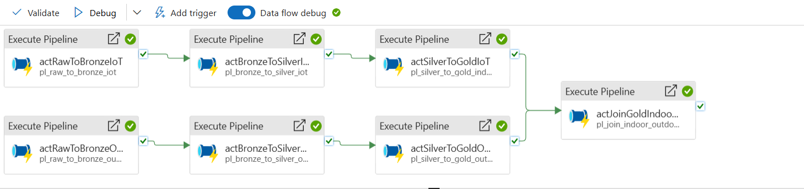

# HVAC Indoor vs Outdoor Climate Comparison - Real Time Production ETL Pipeline usind Azure Data Factory (ADF)

This reporsitory showcases a real-world, **production-grade data engineering pipeline** built entirely on **Azure**. While this GitHub contains simplified sample data and scripts, the design, orchestration, and architecture follow the exact principles and practices used in real enterprise production systems.

The project addresses a business-critical problem in facilities management:

_" How can we continuously monitor, compare, and act upon differences between indoor climate conditions (temperature, humidity) and external weather data in order to **optimise HVAC systems**, **reduce energy costs**, and **maintain occupant comfort**?_

By combining IoT sensor data (indoor) and real-time weather API data (outdoor), this pipeline delivers a centralised Gold dataset for analysis and triggers real-time anomaly alerts when conditions breach thresholds.

# Business Problem and Context

HVAC systems consume a significant portion of building energy. Without correlating **indoor climate conditions** with **outdoor weather**, facilities often: 

- Overheat or overcool spaces unnecessarily.
- Miss anomalies in real-time, leading to discomfort and inefficiency.
- Failt to act on insights because siloed data is not actionable.

**Challenge:** Indoor IoT sensors produce raw, noisy JSON, while weather APIs return differently structured data. Operations teams need a single, **trusted pipeline** that unifies these streams, validates them, and delivers both **historical analytics** and **real-time monitoring.**

# Solution Overview

The solution is a **parallel, modular pipeline** built on **Azure Data Factory (ADF)**, with clear separation of concerns, schema enforcement, and anomaly detection hooks:

- **Raw Layer:** Ingests JSON from IoT sensors and weather APIs.
- **Bronze Layer:** Converts to semi-structured parquet with schema alignment.
- **Silver Layer:** Cleans, validates, and applies type enforcement.
- **Gold Layer:** Joins indoor and outdoor by event_time, computes deltas.
- **Azure SQL:** Stores final dataset for BI/Reporting.
- **Logic Apps:** Detects anomalies in real-time and sends alerts.
- **Master Pipeline:** Orchestrates the entire flow in paralle for indoor and outdoor.

# Architecture (End-to-End Pipeline)




# Implementation Details

**1. Raw Layer - Ingestion:**

The architecture begins with a **dual-stream ingestion strategy**. Indoor IoT climate data is ingested via **ADF Copy Activity**, while outdoor conditions are fetched in real time from the **Open-Meteo API** using the **ADF HTTP connector**. Both are written into **immutable**, **timestamped folders in ADLS Gen2**, establishing a **time-partitioned raw zone** that guarantees lineage and reproducibility. This upfront design choice mirrors real-world production, where auditability and immutability are non-negotiable.

**2. Bronze Layer - Semi-structures Conversion:**

At Bronze, the architecture transitions messy JSON into **schema-stable Parquet**. IoT data flows (df_raw_to_bronze_iot) apply column mapping and type normalization, while weather flows (df_raw_to_bronze_weather) flatten nested arrays and enforce consistent naming. By using **Parquet as the contract format**, the pipeline optimizes for downstream query performance and cost efficiency, reflecting product thinking in format choice — not just moving data, but designing for analytics scalability.

**3. Silver Layer - Cleansed and Validated Data:**

Silver is where **data trust is engineered**. IoT sensor noise (outliers, corrupted readings) is removed, data types are enforced, and duplicates are eliminated. Weather attributes are standardized into common units and validated with assertions. This isn’t just “cleaning”; it is the **creation of a governed, reliable contract layer** that downstream analytics and HVAC control systems can depend on. In production, this **reduces risk** and builds confidence in every decision powered by the data.

**4. Gold Layer - Final Analytics:**

Gold delivers the **business-facing truth**. Silver IoT and Silver Weather are joined on event_time, creating a unified view of indoor vs outdoor climate. Derived metrics like temperature_delta and humidity_delta quantify HVAC load. The Gold dataset is delivered both to **ADLS Gen2** (for scale-out storage) and **Azure SQL** (for BI and dashboards). The SQL sink uses **Managed Identity authentication** and **columnstore indexing** — design decisions that reflect ownership of **security, governance, and performance** in a production setting.
                 
**5. Azure Logic Apps - Realtime Anomaly Detection:**

The architecture extends beyond storage into **real-time operational intelligence**. Once Gold data lands, an **ADF → Logic Apps integration** is triggered. Rule-based conditions (temperature > 30, humidity > 75) are evaluated, and alerts are dispatched via email or Teams. This design embodies **end-to-end ownership**: the pipeline doesn’t just prepare data, it actively closes the loop between engineering and operations, ensuring HVAC anomalies are acted upon instantly.

**6. Master Pipeline Orchestration:**

At the top sits the **Master Orchestration Pipeline**. Built in ADF, it runs Indoor and Outdoor pipelines in **parallel**, converging at Gold. It uses **parameterization**, **retry policies**, **failure hooks into Logic Apps**, and modular sub-pipelines to deliver scalability and resilience. This orchestration is not just execution — it is the **architecture in action**, enforcing modularity, separation of concerns, and enterprise-grade reliability.

# Outcomes and Business Value

- **Unified Data:** Indoor & outdoor climate data joined into one trusted dataset.
- **Real-time Alerts:** Automated anomaly detection prevents inefficiencies.
- **Analytics-Ready:** Gold dataset in Azure SQL fuels dahsboards and reports.
- **Scalable Design:** Parallel orchestration supports multiple facilities.
- **Energy Optimization:** Enables data-driven HVAC tuning -> lower costs + comfort.

# Repository Layout
```
HVAC-Indoor-Outdoor-Climate-Pipeline/
│
├── arm_template/             → ARM export of ADF pipelines
├── diagrams/pipelines/       → Screenshots of ADF dataflows & master pipeline
├── hvac-indoor-outdoor-etl/  → Sample datasets (raw, bronze, silver, gold)
├── sql/                      → SQL DDLs and queries for Gold tables
└── README.md                 → Project documentation

```
# Conclusion

This project is more than just pipelines. It demonstrates how data engineering translates dorectly into operational outcomes: reducing HVAC costs, improving comfort, and ensuring real-time monitoring through **Azure-native tooling.**

It shows from API Ingestion, schema enforcement, and medallion layering to orchestration, anomaly detection, and SQL delivery.

This is exactly how **production pipelines are built and run** - modular, scalable, governed, and impactful.
